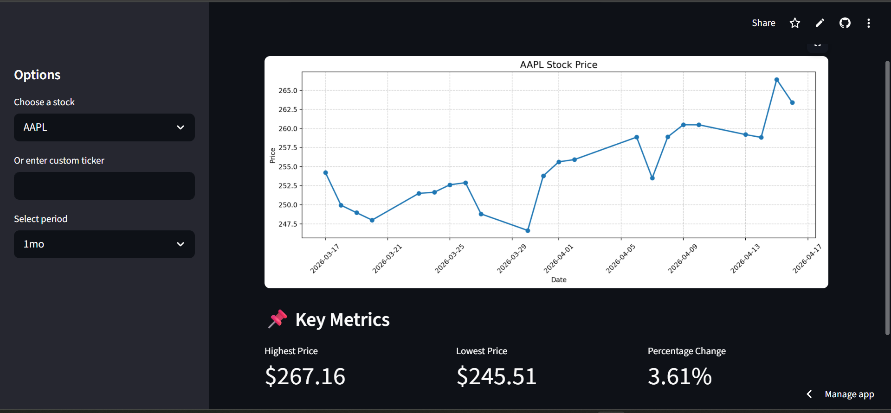

# 📈 Stock Price Viewer


A Python-based stock analysis tool that fetches real-time market data, visualizes trends, and provides key financial insights through both CLI and web applications.

---

## 🌐 Live Demo

🚀 https://stock-viewer-app.streamlit.app/

---

## 📸 Preview

<p align="center">
  
</p>

---

## ✨ Features

- 📊 Real-time stock data using yfinance  
- 📈 Price trend visualization  
- 🔝 Highest & lowest price tracking  
- 📉 Percentage change calculation  
- 🌐 Web app built with Streamlit  
- ⚡ Fast performance using caching  
- 🛡️ Handles invalid inputs safely  

---

## 🛠 Tech Stack

- Python  
- yfinance  
- matplotlib  
- Streamlit  

---

## 💻 Run Locally

### Clone the repository

```bash
git clone https://github.com/Asmitha87Ram/stock-viewer.git
cd stock-viewer
```

### Install dependencies

```bash
pip install -r requirements.txt
```

### Run CLI version

```bash
python app.py
```

### Run Streamlit app

```bash
streamlit run app_streamlit.py
```

---

## 📂 Project Structure

```
stock-viewer/
│── app.py  
│── app_streamlit.py  
│── requirements.txt  
│── screenshot.png  
│── README.md  
```

---

## 🧠 What I Learned

- Working with real-time APIs  
- Data visualization using matplotlib  
- Building web apps using Streamlit  
- Handling real-world data issues  
- Deploying applications to the cloud  

---

## 👨‍💻 Author

**Asmitha Ram**

---

## ⭐ Support

If you like this project, consider giving it a ⭐ on GitHub!